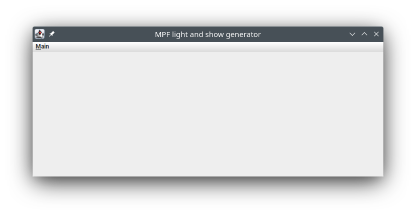
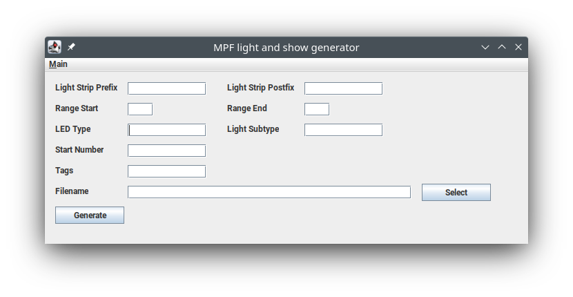
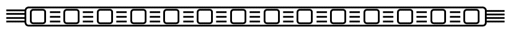
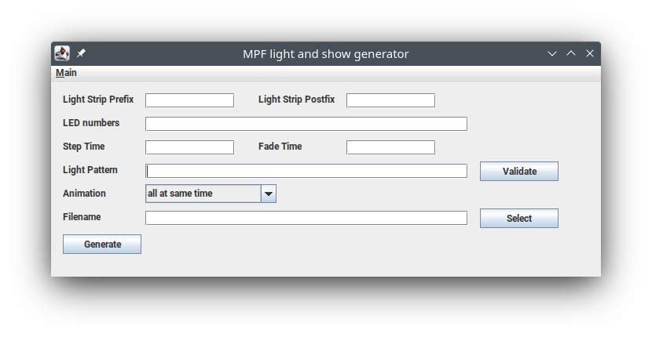

# MPF Light and Show Generator
With this tool you can generate two different types of YAML files for your [MPF]( https://missionpinball.org/) project. On the one hand side it can generate the definition file for your lights, on the other hand side it can generate a light show file.

The tool is developed in Java, so you need to have a Java JDK installed, of course preferably the open source [JDK](https://openjdk.org/).

All you need from this repository is to download the latest jar file from the [release folder](release) and place it somewhere on your computer. Depending on how your computer is set up you can start the tool by just double clicking the jar file. If that doesn't work for your open a CMD prompt (Windows) or a console (Linux and macOS) and run `java -jar <filename>.jar` Where of course you need to enter the real filename of the jar file, you might have to include as well the full path. Instead of typing the full path, just type `java -jar `, with a space after jar, and drag and drop the jar file onto the CMD box. 
A somewhat empty screen comes up, from the main menu select what type of file you would like to generate. 

But first read on, to understand some details.

## Light Definition
Before your can run a light show you need to define your [lights](https://missionpinball.org/mechs/lights/).  You can either define every single light, which is lots of typing work or you can define a full light strip. If you define a light strip, then it seems that you cannot address a single light on it. (Or I have not figured out how to do it, feel free to comment on this [issue report](https://github.com/orgs/missionpinball/discussions/46).) This is basically why I wrote this part of the tool.

### Detailed field description

#### Light Strip Prefix/Postfix, Range Start/End
Each LED in your setup needs to have a unique name, the easiest way is to have a unique name if you use numbers. Maybe you want to name your LEDs like `LED_number_23_of_my_long_LED_strip` where this would be LED number 23 and you might have numbers (=LEDs) from 1 to 59. Then your range start field would be `1`, the range end field would be `59`. The prefix would be `LED_number_` and the postfix would be `_of_my_long_LED_strip`. Prefix or postfix can be left empty if you would like to have the number at the beginning or the end of your name. Note that the start and end number can be any number, you don't have to start with number 0 or 1.

#### Type and Subtype
For details on what you should enter refer to the [MPF light documentation](https://missionpinball.org/config/lights/). If you use LED strips the subtype would be `led` and depending on your type of LED the type would be something like `rgb`.

## Light Show Definition
Once you have defined your lights you want to run a light show. There is already a [tool](https://missionpinball.org/tools/showcreator/) available to create light shows. The main reason why I wrote this tool is that I got the other Show Creator not to work on Linux, thus I had to come up with my own tool. If I just missed the obvious and it should work on Linux, feel free to comment on this [bug report](https://github.com/orgs/missionpinball/discussions/109). My tool here has a slightly different approach, so maybe both tools are useful.

### Basic fundamental idea
The basic idea of this tool is that you can break down a big light show into multiple smaller shows which run in parallel. For example, you might have multiple [illuminated star posts](https://pinside.com/pinball/market/shops/1254-cobra-amusements/08633-cobrapin-serial-rgb-led-star-post-light), each consists of 8 RGB LEDs. In one post all LEDs should flash alternating red and orange, in another a white LED light should run in circles. Using this tool you would be able to define these two shows (which can run in parallel) within seconds.

### Available Light Animations
As of now the tool offers 4 different types of animations. Each will be explained in detail below.

#### All lights same color at same time
You can specify a list of colors, e.g. `red; green; blue` all lights in your defined show will always have the same color and cycle through these colors in the defined time. This will look like this:

#### Lights in same color build up one after one
Let's assume again you have specified the same list of colors, e.g.  `red; green; blue`. This time the LEDs will fill up in the given color one by one until all LEDs have the same color, then it takes the next color and fill up one LED after the next. That will basically look like this:

Keep in mind that `off` is as well a color. If you make use of this, with the same approach you can achieve something like this

#### Different colors for each LED moving through the strip
And again you have specified the same list of colors, e.g.  `red; green; blue`. This time the first LED will take the first color, in the next step that color will move to the second LED and the first LED gets the second color. In the third step, the two LEDs alight move one position down the LED strip and the third color will be applied to the first LED. The lights will move until they vanish at the end of the strip. It would look like this:

If you define the same show in a reversed order (colors reversed and LED lights reversed), you can combine the two definition files in a text editor and will get this effect:

#### Color running in a circle
This fourth mode is made mainly for lights positioned in a circle like beneath a star post, of course technically you can run that as well on a strip of lights. You define a set of lights (maximum amount of colors possible is equal the amount of lights you have). These colors will be applied to the LEDs and then turn in circles.

### Detailed field description
The screen to define a light show looks like this

#### Light Strip Prefix/Postfix
Basically the same as said for the light definition about these fields holds true for the show definition as well. So first read the section above about these fields in the light definition section. Please note a few things which are different

* The end range value can be lower than the start range value, depending on what end of your LED strip the effect should start.
* You need to use the prefix and postfix fields in a way that they match the names of your lights.

#### LED numbers
You most likely use for your show only a subset of lights, you typically have the range not covering all your lights, but only a few, e.g. a certain light strip. In that field you can enter a various formats to specify the light ids which will be used to combine with your light strip prefix and postfix value.

* If you want to specify single LED numbers, enter them as semicolon separated list. E.g. `1; 7; 29`
* If you want to specify a range to cover all numbers, enter for example `1-30`
* Mix and combine the above options, e.g. `1; 5-20; 3; 33-29 `

In most cases you probably enter a simple range, but that depends on your setup. Note, that you can enter a range from a higher to a lower number. That might be important for some animations if you want to have them started on the other end of the strip.

#### Step Time and Fade Time
Both fields need to contain a time value. [Step time](https://missionpinball.org/shows/format) defines how long it takes until the next step in your animation is started. [Fade time](https://missionpinball.org/config/light_player/#fade) describes how much time is being used to fade the LED to the next color.

#### Light Pattern
A list of light values separated by a ";". Each entry should define a certain color, MPF allows the specification via a well known HTML color name, e.g. `LightSalmon`, or a hex RGB value, e.g. `#FFA07A` or a hex RGB with a brightness value, e.g. `#FFA07A%60`. Note, RGB definitions like `[255, 160, 122]` are not supported for a `light_player`. Keep in mind that `on` and `off` are as well valid values, especially `off` can be very handy. You can use the validate button to do a check if the pattern has some obvious errors. Since for example MPF allows you to define own color names, the reported problems are not always a real problem. Check carefully and if you are sure that the reported issue is non, then continue.

#### Animation
The different animations have been explained in detail further above, just select the type of animation you would like to use.

#### Filename
Simply select the filename you would like to use to save your generated file.
